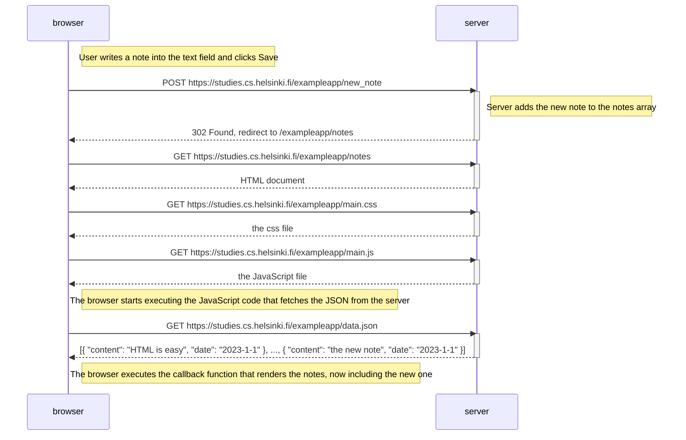
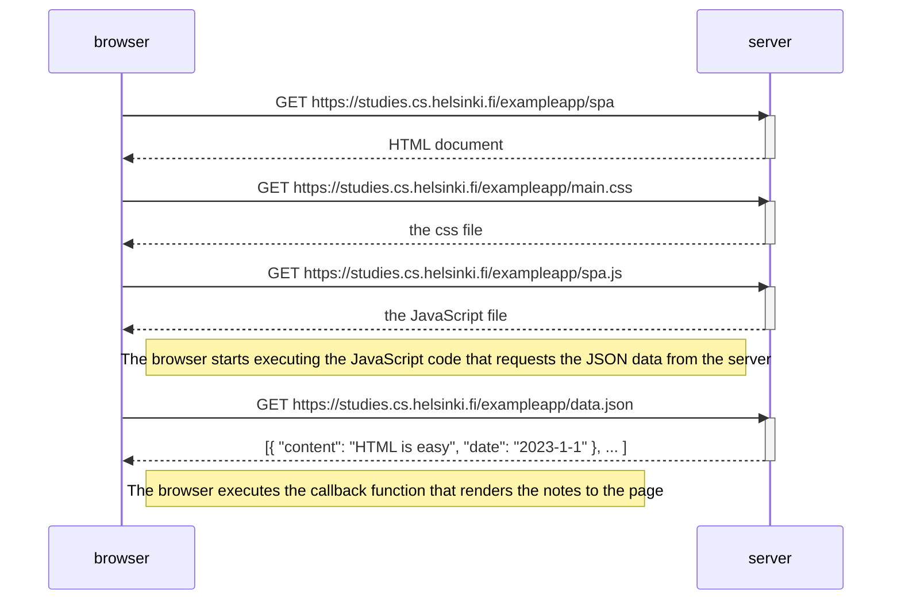
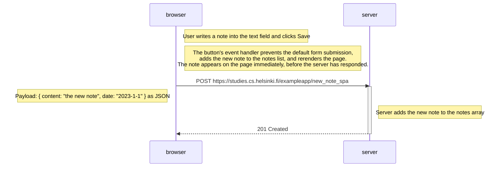

# Part 0 diagrams

## 0.4: New note diagram

Creating a new note on the traditional (non-SPA) page at
`https://studies.cs.helsinki.fi/exampleapp/notes`

Note: clicking Save submits a plain HTML form, so the browser does a full page reload. The whole GET-notes/GET-css/GET-js/GET-data.json cycle from the first diagram happens again after the redirect.

## 0.5: Single page app diagram

Loading the SPA version at `https://studies.cs.helsinki.fi/exampleapp/spa`

Note: unlike the multi-page version, the HTML returned here is (almost) empty — it just references spa.js. All rendering happens in the browser via JavaScript, with no further full-page reloads.

## 0.6: New note in Single page app diagram

Creating a new note in the SPA version

Note: the request is sent asynchronously (via fetch/XHR) with a JSON body instead of a form submission, and the server's response is just a status code — no HTML and no redirect, since the browser already updated the page itself.
